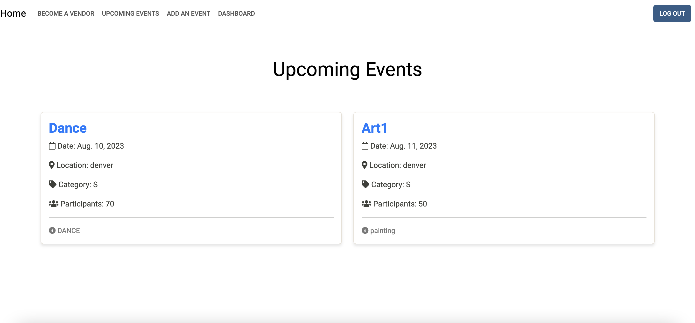
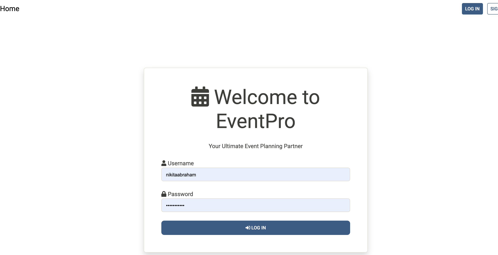

EventPro
Event Pro ia an event planner web based app build on Django framework used to manage the activity related to an event.It is also important for event organizer that he has all the contacts details of the vendors so that the user can contact them any time to plan an event at given time .This app creates an event based on the category . All the upcoming  events are displayed on the dashboard of the app. The app also has a field to become a vendor. 

Application allows  only authorized user to perform CRUD (create, read, update, delete) operations on events data.
Below points describes the features of the application: 
-The user can sign up or login with their existing account .
-Once the user is logged in ,on dashboard all the upcoming events are listed.
-User can add new events.
-User can also add new vendors to the events.
-User can comment on any of the listed events.
-Event created by user can only update or delete.

Screenshot(s): 

Technologies Used:
Django
Python
PostgreSQL
HTML
CSS

Getting Started: 
https://eventpro-74856-ccdd70a7f67a.herokuapp.com/

https://trello.com/b/OKOEHVgo/event-planner

https://docs.google.com/presentation/d/1Ss4YYHW8K-RC3jIvLvi6cGgX6zONdHQV55XTkQUQLBY/edit?usp=sharing

Next Steps: 
Future Enhancement to add the status field of the event scheduled ,event completed.
Rating for the Vendor.